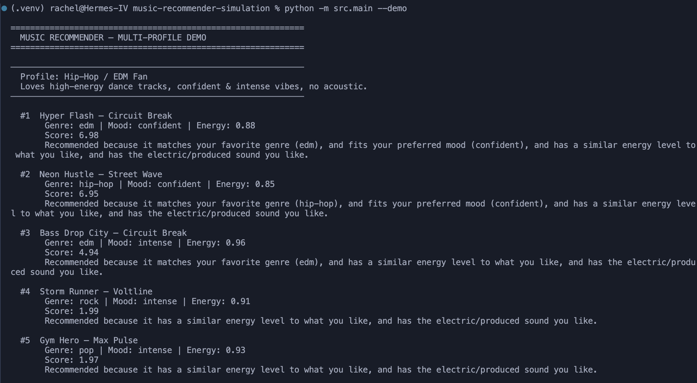
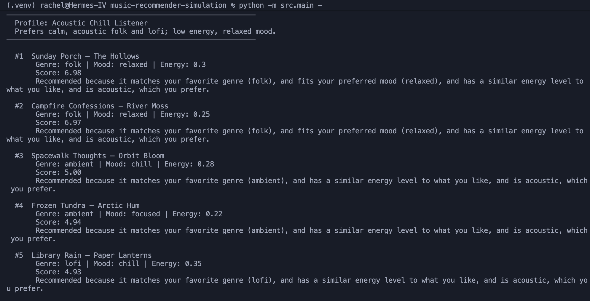
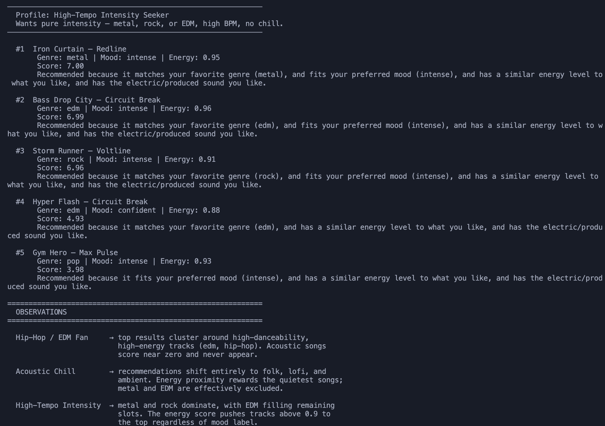

# Music Recommender Simulation

## Project Summary

Songs & Vibes is a content-based music recommender built from scratch in Python. It represents songs as structured data objects with features like genre, mood, energy, and acousticness, then scores each song against a user's taste profile using weighted feature matching. The system also includes a cold-start onboarding flow that collects feedback on a few bootstrap songs before making personalized recommendations.

---

## How The System Works

### Song Features

Each `Song` in the catalog has the following attributes:

- `genre` - musical category (e.g., lofi, metal, edm, folk)
- `mood` - emotional tone (e.g., chill, intense, relaxed, confident)
- `energy` - float from 0.0 (very calm) to 1.0 (very intense)
- `tempo_bpm` - beats per minute
- `valence` - how positive or happy the song feels (0–1)
- `danceability` - how suitable it is for dancing (0–1)
- `acousticness` - how acoustic vs. produced the song sounds (0–1)

### User Profile

A `UserProfile` stores:

- `favorite_genres` - list of preferred genres
- `favorite_mood` - the mood the user wants to feel
- `target_energy` - ideal energy level (0–1)
- `likes_acoustic` - boolean preference for acoustic vs. electric sound
- `liked_song_ids` / `disliked_song_ids` - explicit feedback history

### Scoring Logic

`score_song(user, song)` computes a numeric score for each song:

| Feature | Points |
| --- | --- |
| Genre match | +3.0 |
| Mood match | +2.0 |
| Energy proximity | up to +1.0 (closer = higher) |
| Acoustic preference match | +1.0 |
| Previously liked song | +5.0 |
| Previously disliked song | -10.0 |

Songs are ranked by score and the top `k` are returned along with a plain-language explanation of why each was selected.

### Cold-Start Flow

New users go through a 4-step onboarding before any history exists:

1. Pick genres they like from the available catalog
2. See 5 popular songs from those genres (ranked by energy + danceability)
3. Rate each song thumbs up or down
4. Profile is automatically refined from their feedback before recommendations run

---

## Getting Started

### Setup

1. Create a virtual environment (optional but recommended):

   ```bash
   python -m venv .venv
   source .venv/bin/activate      # Mac or Linux
   .venv\Scripts\activate         # Windows
   ```

2. Install dependencies:

   ```bash
   pip install -r requirements.txt
   ```

3. Run the interactive onboarding:

   ```bash
   python -m src.main
   ```

4. Run the multi-profile demo (no input required):

   ```bash
   python -m src.main --demo
   ```

### Running Tests

```bash
pytest
```

---

## Experiments - Multi-Profile Demo

Three distinct user profiles were run to compare how the recommender behaves for different listener types.

### Profile 1: Hip-Hop / EDM Fan

Loves high-energy dance tracks, confident & intense vibes, no acoustic.



### Profile 2: Acoustic Chill Listener

Prefers calm, acoustic folk and lofi; low energy, relaxed mood.



### Profile 3: High-Tempo Intensity Seeker

Wants pure intensity - metal, rock, or EDM, high BPM, no chill.



### Observations

- **Hip-Hop / EDM Fan** - Top results cluster around high-danceability, high-energy tracks (edm, hip-hop). Acoustic songs score near zero and never appear in the top 5.
- **Acoustic Chill Listener** - Recommendations shift entirely to folk, lofi, and ambient. Energy proximity rewards the quietest songs; metal and EDM are effectively excluded.
- **High-Tempo Intensity Seeker** - Metal and rock dominate, with EDM filling remaining slots. The energy score pushes tracks above 0.9 to the top regardless of mood label - "Gym Hero" (pop) sneaks in at #5 purely because of its high energy, even though it is not in the user's preferred genres.

The contrast between profiles shows that genre weight (3 pts) and energy proximity work together as the dominant signals. A song in the wrong genre will almost never outrank a genre match, even with a perfect mood fit.

---

## Limitations and Risks

- **Small catalog** - 22 songs means niche genres like metal or country have very few candidates, making it hard to fill a top-5 with variety.
- **No collaborative filtering** - The system has no concept of what other users liked, so it cannot surface unexpected but relevant songs.
- **Genre weight dominates** - A song in the right genre will almost always outrank a song in the wrong genre regardless of every other feature.
- **Binary acoustic preference** - Users either like acoustic or they don't; there is no spectrum for "somewhat acoustic" preferences.
- **Unused features** - Tempo, valence, and danceability are stored in the data but not used in scoring, so two songs with very different feels can receive the same score.

---

## Reflection

Building Songs & Vibes made the mechanics of content-based filtering very concrete. The system works exactly as well as the features it knows about - if mood and genre are in the data, those drive the result; if lyrical theme or tempo range are not weighted, the model is blind to them. That gap between "what we measured" and "what the user actually feels" is probably the most important limitation of any recommender, not just this one.

It was also surprising how much the weighting choices matter. Changing the genre weight from 3.0 to 1.0 completely reshuffled the rankings for mixed-genre users. Real platforms like Pandora and Spotify spend enormous effort tuning exactly these weights, and this simulation made it clear why small changes in the scoring formula have an outsized effect on what people actually hear. Even a simple system like this one can reflect bias - in this case, toward high-energy tracks - just from how the weights are set.

---

## Model Card

[**Model Card**](model_card.md)
